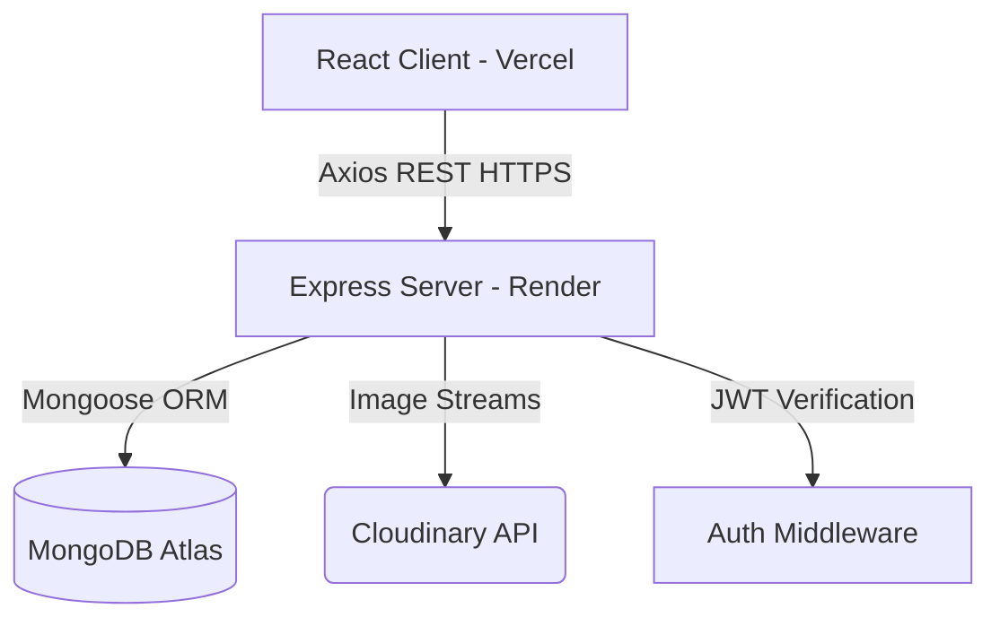
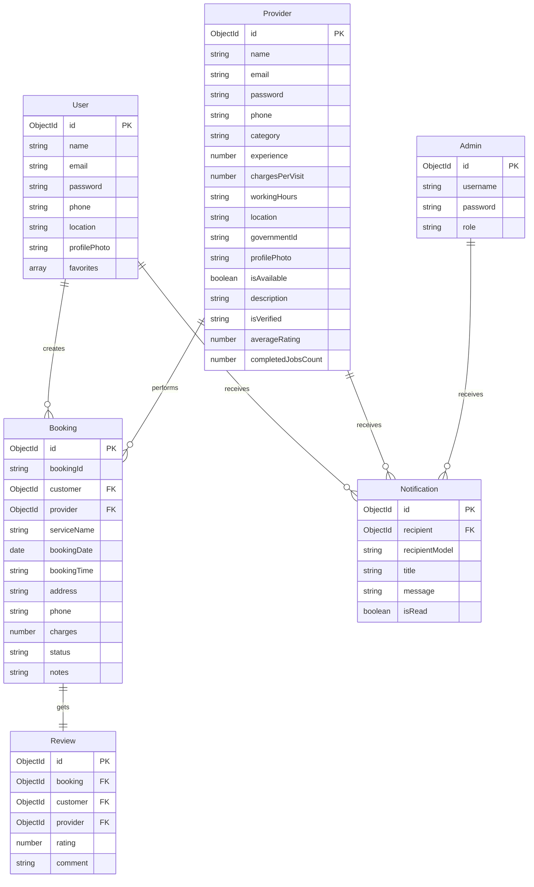

# SERVNEXA 
connecting customers,empowering procviders managing services

ServNexa is a complete, production-ready, full-stack Cloud-Based Home Service Booking Platform that connects customers with verified local service professionals (electricians, plumbers, cleaners, technicians). The platform is built on a Node.js/Express backend, React.js frontend, and a MongoDB Atlas database.

---

## 1. System Architecture



---

## 2. Database Schema & ER Diagram



---

## 3. Folder Structure Overview

```
miniproject22/
├── backend/
│   ├── config/          # Database (Mongoose) & Cloudinary SDK configs
│   ├── controllers/     # Business logic (Auth, Bookings, Customers, Providers, Reviews, Admins)
│   ├── middleware/      # JWT auth, role validation, file upload configs
│   ├── models/          # Mongoose Schemas (User, Provider, Admin, Booking, Review, Notification)
│   ├── routes/          # Express route bindings
│   ├── utils/           # Database seeder scripts
│   ├── .env             # Active environment settings
│   ├── package.json     # Backend script runner
│   └── server.js        # Server launch file
├── frontend/
│   ├── src/
│   │   ├── assets/      # Tailwind styles
│   │   ├── components/  # Reusable components (Navbar, Sidebar, ProviderCard, BookingModal, SkeletonLoader)
│   │   ├── context/     # React state managers (AuthContext, NotificationContext)
│   │   ├── pages/       # Portal views (Home, Explore, Details, Dashboards, Auth screens)
│   │   ├── services/    # Axios client and config
│   │   ├── App.jsx      # Navigation routing & guards
│   │   ├── index.css    # Tailwind entry & custom CSS themes
│   │   └── main.jsx     # Virtual DOM mounter
│   ├── package.json     # Frontend dependencies configuration
│   └── vite.config.js   # Vite configuration including Tailwind v4
└── package.json         # Workspace execution scripts
```

---

## 4. REST API Documentation

### Authentication (`/api/auth`)
- `POST /register/customer` - Create customer account. Form-data with fields `name`, `email`, `phone`, `password`, `location`, `profilePhoto` (file).
- `POST /register/provider` - Create provider account. Form-data with fields `name`, `email`, `phone`, `password`, `category`, `experience`, `chargesPerVisit`, `workingHours`, `location`, `description`, `profilePhoto` (file), `governmentId` (file).
- `POST /login/customer` - Body: `{ email, password }`. Returns JWT token + User metadata.
- `POST /login/provider` - Body: `{ email, password }`. Returns JWT token + Provider metadata.
- `POST /login/admin` - Body: `{ username, password }`. Returns JWT token.
- `POST /forgot-password` - Body: `{ email, role }`. Generates mock verification token.
- `POST /reset-password` - Body: `{ role, token, password }`. Resets password.

### Customers (`/api/customers`) - *Protected*
- `GET /profile` - Retrieve current customer info.
- `PUT /profile` - Update customer info. Supports profile picture upload.
- `POST /favorites/:providerId` - Toggle provider bookmark in favorites list.
- `GET /favorites` - Fetch customer's favorite providers.

### Providers (`/api/providers`)
- `GET /` - Public directory search. Query filters: `category`, `location`, `minRating`, `maxPrice`, `isAvailable`.
- `GET /:id` - Retrieve profile info + customer reviews for a specific provider.
- `PUT /profile` - Update provider schedule, rates, location, description. *Protected (Provider only)*. Supports profile picture upload.

### Bookings (`/api/bookings`) - *Protected*
- `POST /` - Request a booking. Body: `{ providerId, bookingDate, bookingTime, address, phone, notes }`. *Protected (Customer only)*.
- `GET /customer` - Fetch customer booking appointments history. *Protected (Customer only)*.
- `GET /provider` - Fetch provider booking jobs calendar. *Protected (Provider only)*.
- `PUT /:id/status` - Update booking state. Body: `{ status }`. Allowed statuses: `accepted`, `rejected`, `completed`, `cancelled`.

### Reviews (`/api/reviews`)
- `POST /` - Post review for a completed booking. Body: `{ bookingId, rating, comment }`. *Protected (Customer only)*.
- `GET /provider/:providerId` - Publicly fetch ratings and comments for a provider.

### Notifications (`/api/notifications`) - *Protected*
- `GET /` - Retrieve all in-app notifications.
- `PUT /:id/read` - Mark a notification alert as read.

### Admin Panel (`/api/admin`) - *Protected (Admin only)*
- `GET /dashboard` - Aggregated stats counters & status distributions.
- `GET /providers/pending` - Fetch pending verifications list.
- `PUT /providers/:id/verify` - Approve/Reject a provider profile. Body: `{ status: "approved" | "rejected" }`.
- `GET /users` - List all customers.
- `GET /providers` - List all providers.
- `GET /bookings` - List all platform bookings.

---

## 5. Installation & Local Development Guide

### Prerequisites
- Node.js (v18+)
- Local MongoDB or MongoDB Atlas cluster credentials

### 1. Configure Environment Variables
Create a `.env` file under `backend/`:
```env
PORT=5000
MONGO_URI=your_mongodb_atlas_connection_string
JWT_SECRET=any_jwt_secret_key_string
JWT_EXPIRE=30d
CLOUDINARY_CLOUD_NAME=your_cloudinary_cloud_name
CLOUDINARY_API_KEY=your_cloudinary_api_key
CLOUDINARY_API_SECRET=your_cloudinary_api_secret
```

### 2. Install Dependencies
Run the install command in the workspace root directory:
```bash
npm run install:all
```
This automatically installs node modules for the backend, and uses `--legacy-peer-deps` to securely resolve dependencies on Vite React 19 frontend.

### 3. Seed Database
Wipe collections and populate data (including the default Administrator account):
```bash
npm run seed
```
*Note: Seeding requires the database connection to be active.*

**Default Credentials Seeded:**
- **Admin**: Username: `admin` | Password: `adminpassword123`
- **Customer**: Email: `sarah@example.com` | Password: `password123`
- **Provider**: Email: `john@example.com` | Password: `password123`

### 4. Start Development Servers
Open two terminal windows in the workspace root:
- Run backend: `npm run start:backend`
- Run frontend: `npm run start:frontend`

---

## 6. Cloud Deployment Guide

### Database Setup: MongoDB Atlas
1. Create a free Shared Cluster on [MongoDB Atlas](https://www.mongodb.com/cloud/atlas).
2. Go to **Network Access** and add IP `0.0.0.0/0` (allow access from anywhere).
3. Go to **Database Access** and create a user (Username & Password).
4. Click **Connect** → **Connect your application** and copy the URI string. Set this as `MONGO_URI` in your backend variables.

### Media Server Setup: Cloudinary
1. Register on [Cloudinary](https://cloudinary.com).
2. In the Dashboard console, find and copy your **Cloud Name**, **API Key**, and **API Secret**.
3. Set these in the backend `.env` variables to transition file uploads to the cloud.

### Backend Hosting: Render
1. Register on [Render](https://render.com) and link your GitHub repository.
2. Click **New** → **Web Service**.
3. Select your repository, configure:
   - **Build Command**: `npm install`
   - **Start Command**: `node server.js`
   - **Root Directory**: `backend`
4. Add all values from `.env` in the Render environment variables tab. Launch the service.

### Frontend Hosting: Vercel
1. Register on [Vercel](https://vercel.com) and click **Add New Project**.
2. Select your repository, configure:
   - **Framework Preset**: `Vite`
   - **Root Directory**: `frontend`
3. Add `VITE_API_URL` under Environment Variables, pointing to your deployed Render URL (e.g. `https://your-service.onrender.com/api`).
4. Click **Deploy**.
